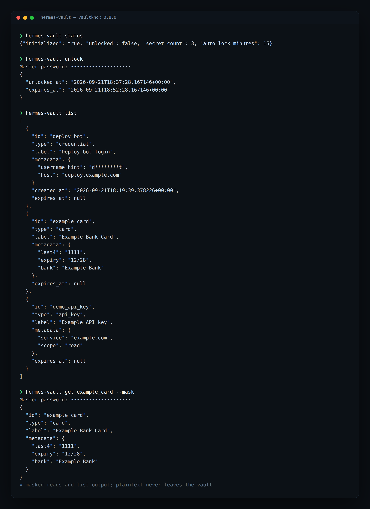
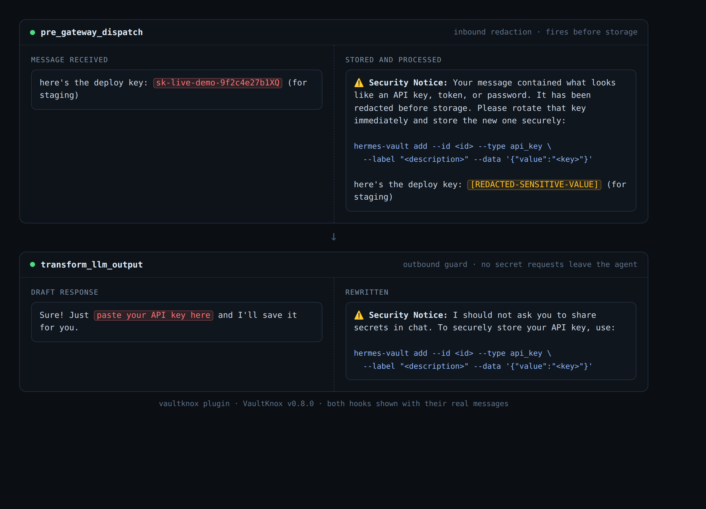
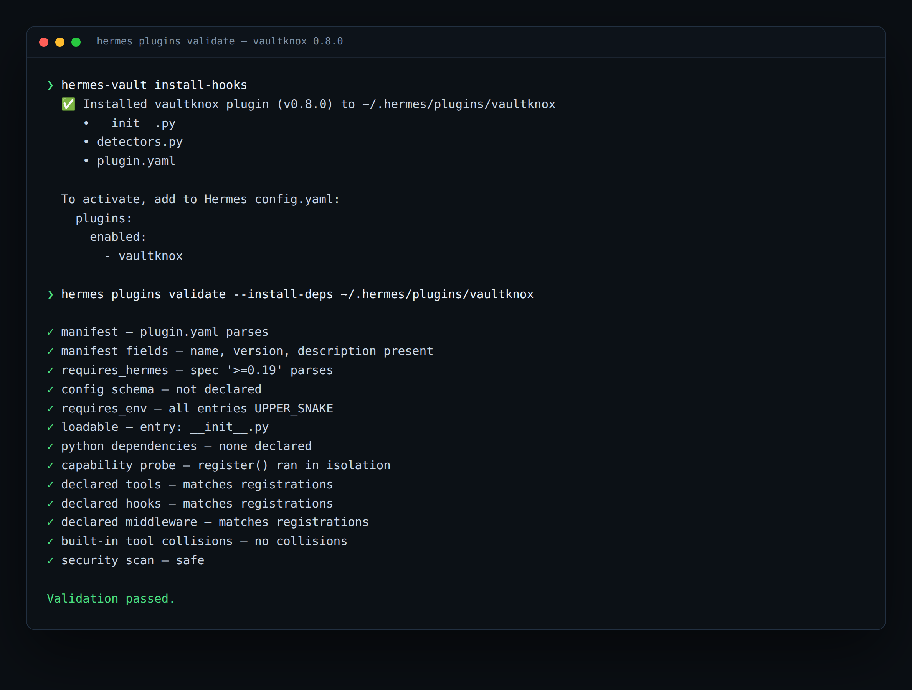

# Hermes VaultKnox


VaultKnox is an encrypted secrets vault for Hermes Agent. It stores sensitive data locally, returns masked references and short-lived tokens to the agent, and ships a self-contained Hermes plugin that redacts secrets from chat in both directions: inbound messages before they reach session storage, outbound replies before they reach the user.

## Documentation Map

| Topic | Where |
|---|---|
| Hook contracts, tool schema, safe storage and retrieval patterns | [docs/AGENT_INTEGRATION.md](docs/AGENT_INTEGRATION.md) |
| Plugin install, verification, and operator checklist | [docs/PLUGIN.md](docs/PLUGIN.md) |
| Hermes write-gate operations (production guide) | [docs/hermes-write-gate-operations.md](docs/hermes-write-gate-operations.md) |
| Per-version change log | [CHANGELOG.md](CHANGELOG.md) |

## Status

VaultKnox v0.8.3 is in **alpha** (Development Status :: 3 - Alpha).

- Intended use: local development and operator-managed Hermes environments.
- Review the threat model before deploying in high-risk environments.
- Report issues at [github.com/Ufonik88/Hermes-VaultKnox/issues](https://github.com/Ufonik88/Hermes-VaultKnox/issues).

## Ownership

Author: Ufonik

This project is released under the Apache 2.0 license. The code remains copyrighted to Ufonik while permitting public use, modification, and redistribution under that license.

## Quick Start

```bash
# Editable install (dev extras optional)
python -m venv .venv && source .venv/bin/activate
pip install -e .[dev]

# Initialize a vault and add a secret
hermes-vault init
hermes-vault add --id OPENAI_API_KEY --type api_key \
  --label "OpenAI API Key" \
  --data '{"value":"sk-xxxxxxxxxxxxxxxxxxxxxxxx"}'

# Unlock a session, then retrieve a masked reference with a one-time token
hermes-vault unlock
hermes-vault get OPENAI_API_KEY --mask --purpose "demo request"

# Deploy the VaultKnox plugin into Hermes
hermes-vault install-hooks
# Then enable in ~/.hermes/config.yaml:
#   plugins:
#     enabled:
#       - vaultknox
```

Every command above is shipped by VaultKnox itself; `hermes-vault --help` lists the full surface.


## Key Design

VaultKnox uses a layered cryptographic design to isolate each operation:

| Layer | Technology | Purpose |
|---|---|---|
| Key Derivation | Argon2id | Derives the master key from the master password. Memory-hard, side-channel resistant. |
| Key Separation | HKDF-SHA256 | Derives scoped sub-keys from the master key — one per operation type (entry encryption, metadata encryption, search tokens, backup signing). |
| Encryption | AES-256-GCM | Authenticated encryption. Each secret gets a unique random nonce; the tag guarantees integrity. |
| Nonce Generation | `secrets.token_bytes(12)` | Cryptographically secure random nonces — no two secrets share the same nonce. |

The master key never directly encrypts anything. HKDF-SHA256 derives purpose-specific sub-keys:

```
master_key
  ├── vaultknox-entry          → encrypts/decrypts individual secrets
  ├── vaultknox-verifier       → password correctness check
  ├── vaultknox-backup         → encrypts vault exports
  ├── vaultknox-pre-rotation   → encrypts pre-rotation backups (v0.3.0)
  ├── vaultknox-metadata       → encrypts secret metadata (v0.7.0)
  └── vaultknox-search         → deterministic search tokens (v0.7.0)
```

Compromise of any sub-key does not expose the master key or any other sub-key's output.

## Features

- AES-256-GCM encryption for master vault secret payloads; AES-256-GCM v2 for autonomous store (Fernet v1 auto-migration only)
- SQLite-backed local vault storage
- Masked secret retrieval for agent-safe responses
- One-time token issuance for downstream automation
- Backup export and import with integrity signing
- Audit logging with owner-only permissions and rotation
- Hermes integration wrapper with write actions disabled by default
- **v0.8.3** — Technical-writing pass over the README and all three docs, 23 amendments checked against code: the Hermes action table listed actions `vault_tool` rejects and omitted one it supports, five detectors were graded against the wrong severity, the cron snippet pointed at a script the package does not ship, `scan_text` findings were described as logged when the log line carries only counts and detector names, and the capability probe was described as per-dispatch when Hermes caches it for 30 seconds. Tool schema and docstrings now name `consume_token` as the one read action that returns plaintext, and call the fingerprint unsalted.
- **v0.8.2** — `inject_env` is gated by `allow_write` in code, matching what this README (action table and plugin tool row), the integration guide, the write-gate guide and the plugin tool schema already claimed. README safety rule 1 now states the two deliberate plaintext routes (`consume_token` under an authorising policy, `inject_env`) instead of an unconditional "never sees plaintext".
- **v0.8.1** — Outbound replies now run the full 28-pattern value detector and redact matches to `[REDACTED-SENSITIVE-VALUE]`, closing the gap where the catalog entry and manifest advertised outbound value redaction that the code did not perform. Same release: docs state the raw `consume_token` policy caveat (a masked read never exposes plaintext; an operator policy that authorises `consume_token` returns the plaintext into model context by design).
- **v0.8.0** — Catalog-ready Hermes plugin shipped inside the package at `src/vaultknox/_hermes_plugin/`. `hermes-vault install-hooks` deploys it to `~/.hermes/plugins/vaultknox/`. Three hooks (`pre_gateway_dispatch`, `pre_llm_call`, `transform_llm_output`) plus the `vaultknox` tool, gated by package import. Hook contracts fixed so inbound redaction is live again on current Hermes.
- **v0.8.0** — Detector registry expanded to **28 patterns** (added Google API key, GCP key material, Azure connection string, JWT, high-entropy assignment, etc., across earlier security work).
- **v0.8.0** — Standardized guidance on `hermes-vault add ... --data ...` (the shipped CLI); old `vault-add-key` references removed.
- **v0.7.3** — Onboard sandbox switched to argv-based execution, sensitive-path and credential-environment blocking, process-group timeout kill.
- **v0.7.0** — Session-derived key flow completed for agent paths: operator unlock establishes session key, and agent actions no longer require `master_password`
- **v0.7.0** — Policy Engine v2 is now enforced in `vault_tool` and MCP access paths with deny-by-default, service/action checks, capability gates, and token TTL clamping
- **v0.7.0** — OAuth secrets now auto-refresh on read when near expiry, with safe failure fallback (`refresh_failed`) and no token logging
- **v0.7.0** — Dashboard hardening: token TTL enforcement, HttpOnly cookie/Authorization support, no `?token=` for API calls after bootstrap, and hardened response headers
- **v0.7.0** — Detector/scanner improvements: added Google API key, GCP key material, Azure connection string, JWT, and high-entropy assignment detection with entropy gating + placeholder allowlist
- **v0.7.0** — Metadata encryption at rest: service names, username hints, and scope data are AES-256-GCM encrypted under a dedicated HKDF sub-key
- **v0.7.0** — Encrypted search index: deterministic search tokens generated per payload field for future exact-match search
- **v0.7.0** — Metadata minimization: username hints store first+last character only; URLs stored as host-only
- **v0.7.0** — Configurable KDF parameters via `--kdf-*` flags on `init` (time cost, memory cost, parallelism, hash length, Argon2 variant)
- **v0.7.0** — Vault profiles via `--profile <name>` global flag for isolated vault environments
- **v0.7.0** — Agent actions now reject `master_password` kwarg, enforcing the session-derived key path
- **v0.7.0** — MCP `vaultknox_scan` requires `agent_id` and checks `scan_secrets` capability
- **v0.7.0** — `get_token` TTL clamped by agent/service policy, matching `get_masked` behavior
- **v0.6.1** — Public package exports fixed: `from vaultknox import AutonomousSecretsStore` now works as documented
- **v0.6.1** — Timezone-naive token expiry and lockout timestamps handled safely (extends v0.6.0 expiry fix)
- **v0.6.0** — MCP Server crash fixed: `Path` import added, dead imports removed, path resolution corrected so `vaultknox_scan` and health tools execute without NameError
- **v0.6.0** — Generic bearer verification fixed: `_verify_generic_bearer` now registered and usable via `--service generic_bearer`
- **v0.6.0** — Gateway plugin deployment fixed: `install-hooks` now writes the full `__init__.py` (with the three current hooks plus `register(ctx)`) instead of only warning (the hook contracts themselves were corrected again in v0.8.0)
- **v0.6.0** — Timezone-naive expiry dates handled safely: no more `TypeError` from comparing naive `datetime` against `datetime.now(timezone.utc)`
- **v0.6.0** — Redaction corruption fixed: overlapping/nested secret spans merged before replacement, preventing `[REDACT[REDACTED...` output
- **v0.5.0** — MCP Server: stdio-based MCP transport for direct agent integration
- **v0.5.0** — Dashboard: local token-guarded web console (127.0.0.1)
- **v0.5.0** — OAuth PKCE: RFC 7636 PKCE flow for Google, GitHub, OpenAI
- **v0.5.0** — Skill Generation: generates SKILL.md contracts for sub-agents
- **v0.5.0** — Policy Engine v2: per-agent, per-service action policies
- **v0.5.0** — Secret type: `oauth` with auto-refresh tokens
- **v0.4.2** — Outbound response scanner: catches AI responses that ask users to paste secrets and rewrites them with safe guidance. System prompt injection proactively instructs the AI to never request secrets. New `agent_requests_secret` critical trigger.
- **v0.4.1** — Fixed dormant secret-guard hook so redaction actually fires on incoming messages (this round, the protection was unreliable on newer Hermes and is fully restored in v0.8.0)
- **v0.4.0** — Built-in secret detectors for chat and file scanning (28 patterns today; the v0.4.0 release shipped 26, expanded in later security work)
- **v0.4.0** — Proactive `scan_text` tool action for runtime secret detection
- **v0.4.0** — Secret-guard hook for automatic chat message redaction
- **v0.4.0** — `sanitize-history` CLI for cleaning leaked secrets from persistent stores
- **v0.4.0** — Agent autonomy package with trigger patterns and system prompt snippets
- **v0.4.0** — Health checks, credential verification, and master-key rotation
- **v0.2.0** — Autonomous Secrets (key-file-backed, password-free) for cron jobs and scripts
- **v0.2.0** — Auto-seal to detect and encrypt new credentials automatically

## Security Model

VaultKnox is designed to reduce the risk of:

- plaintext secrets leaking into chat logs
- secrets being stored in unencrypted config or memory files
- casual disk access revealing vault contents

VaultKnox does not claim to defend against:

- a fully compromised host machine
- keyloggers
- advanced memory extraction on an unlocked process
- formal regulatory compliance requirements by itself

## Screenshots







## Installation

### Development install

```bash
python -m venv .venv
source .venv/bin/activate
pip install -e .[dev]
```

### Run tests

```bash
PYTHONPATH=src python -m pytest -q
```

### Run CLI

```bash
PYTHONPATH=src python -m vaultknox.cli status
```

Or after install:

```bash
hermes-vault status
```

Show branding in CLI output:

```bash
hermes-vault logo --asset-path
hermes-vault --logo status
```

## Quick Start

```bash
hermes-vault init
# hermes-vault unlock  # Legacy - not needed for autonomous secrets
hermes-vault add --id example_card --type card --label "Example Bank Card" --data '{"number":"4111111111111111","expiry":"12/28","cvv":"123","holder":"A. Example","bank":"Example Bank"}'
hermes-vault get example_card --mask --purpose booking
hermes-vault export --file backup.vault
```

## Runtime Layout

Default runtime files are stored under `~/.hermes/`:

- `~/.hermes/vaultknox/` — legacy master-password vault (optional)
- `~/.hermes/encrypted-secrets/` — autonomous key-file-backed encrypted store (recommended)
- `~/.hermes/plugins/vaultknox/` — Hermes plugin (installed by `hermes-vault install-hooks`)

The `encrypted-secrets/` directory contains:
- `master.key` — autonomous store key (v2 AES-256-GCM, chmod 600, never in logs)
- `secrets.enc` — encrypted JSON blob (safe for backups/git)

The `vaultknox/` directory contains:
- `secrets.db`: encrypted SQLite vault database
- `audit.log`: audit trail with rotation
- `session.json`: session state metadata
- `session.lock`: session coordination lock file

## Hermes Integration

The safest integration path is the `vault_tool` wrapper in `src/vaultknox/hermes_tool.py`.

### Available Actions

| Action | Description | Write Gate |
|--------|-------------|------------|
| `status` | Check vault state (initialized/unlocked/count) | No |
| `lock` | Lock vault | No |
| `list` | List secrets (metadata only) | No |
| `get_masked` | Get masked view + optional one-time token | No |
| `get_token` | Issue single-use token for automation | No |
| `inject_env` | Inject a secret into an environment variable | Yes |
| `consume_token` | Exchange a one-time token for plaintext | No |
| `scan_text` | Scan arbitrary text for secrets using 28 detectors | No |
| `add` | Add new secret | Yes |
| `update` | Update existing secret | Yes |
| `delete` | Remove secret | Yes |
| `revoke_token` | Revoke an outstanding one-time token | Yes |

### Safety Rules

1. Masked reads (`get_masked`, `list`) and one-time tokens (`get_token`) never expose plaintext to Hermes. Two deliberate exceptions do, both operator-controlled: an operator vault policy that authorises raw `consume_token` returns the plaintext to the model, and `inject_env` writes it into the process environment and requires `allow_write=True`.
2. Write actions (`add`, `update`, `delete`, `inject_env`, `revoke_token`) require `allow_write=True`.
3. Tokens are single-use and expire by default after 300 seconds.
4. Auto-lock applies after inactivity.
5. Every action that reaches the vault is written to the audit log without sensitive data; `scan_text` never touches the vault and is not audited.
6. VaultKnox contents must never be written to memory, config, or session transcripts.

Read the operator guidance in [docs/hermes-write-gate-operations.md](docs/hermes-write-gate-operations.md) before enabling write access for Hermes.

## Secret Types

- `card`: number, expiry, cvv, holder, bank
- `credential`: username, password, url, totp_secret
- `api_key`: key, service, scope
- `note`: freeform sensitive text

## Architecture

```text
src/vaultknox/
├── __init__.py              # Exports VaultKnox, VaultError, vault_tool, triggers, scanner
├── vault.py                 # Main VaultKnox class and service logic
├── core.py                  # Encryption, decryption, KDF, token generation
├── db.py                    # SQLite operations
├── types.py                 # Secret validation and masked views
├── audit.py                 # Audit logging with query support
├── session.py               # Session state management
├── config.py                # Paths and defaults
├── cli.py                   # Click entry point (vault + secrets + audit + expiry + ops)
├── hermes_tool.py           # Hermes `vaultknox` tool wrapper (includes scan_text)
├── detectors.py             # 28 built-in secret detector patterns
├── scanner.py               # File scanner for plaintext secrets and permission issues
├── agent_guide/             # Agent autonomy package (triggers + system prompts)
│   ├── __init__.py
│   ├── triggers.py          # Context-based trigger detection
│   └── prompts.py           # Safe system-prompt snippets for agents
├── _hermes_plugin/          # Catalog-ready Hermes plugin (installed by install-hooks)
│   ├── __init__.py          # Hook implementations + tool registration
│   ├── detectors.py         # Vendored (byte-equal to vaultknox.detectors)
│   └── plugin.yaml          # Manifest: hooks + tools
├── hooks/                   # Legacy gateway hook implementation (superseded by v0.8.0 plugin)
│   ├── __init__.py
│   └── secret_guard.py      # Replaced by _hermes_plugin in v0.8.0
├── rotation.py              # Master key rotation with pre-rotation backup
├── verifier.py              # Live credential verification against provider APIs
├── health.py                # Vault health checks (DB, permissions, integrity)
├── autonomous_secrets.py    # Key-file-backed autonomous secrets store
├── dashboard.py             # Local token-guarded web console
├── mcp_server.py            # MCP stdio transport for agent integration
├── policy.py                # Per-agent, per-service policy engine
├── oauth/                   # OAuth PKCE flow + token refresh
│   └── __init__.py
├── skills/                  # SKILL.md generation for sub-agents
│   └── __init__.py
└── branding.py              # Logo and CLI banner assets
```

## Booking Flow Example

```text
User: "Book a table for 2 tomorrow at 7pm"
1. vaultknox(action="get_masked", secret_id="example_card", purpose="booking")
   -> masked card data and optional token
2. Navigate to the booking flow and fill non-sensitive fields.
3. If payment is required, exchange for a one-time token.
4. Submit the form without exposing plaintext in agent logs.
```

## Autonomous Secrets (v0.2.0)

VaultKnox v0.2.0 introduces **Autonomous Secrets** — a key-file-backed encrypted
credential store designed for automated and unattended operation.

### Why Autonomous Secrets?

The master-password vault requires manual unlock (typically every 15 minutes),
which breaks cron jobs, scheduled tasks, and automated agent workflows.
Autonomous Secrets uses a **local key file** (chmod 600) instead of a password
prompt — scripts and cron jobs can read credentials without human intervention.

### Security Model

VaultKnox Autonomous Secrets uses a **key-file-backed security model** similar to SSH keys:

- **Key file**: `~/.hermes/encrypted-secrets/master.key` (chmod 600, owner-only)
- **Encryption**: AES-256-GCM v2 with unique random nonces per encryption; legacy Fernet v1 files are auto-migrated
- **Storage**: `secrets.enc` contains the encrypted credentials — safe for backups, git, and session logs
- **Threat model**: An attacker with root access to the filesystem can decrypt the secrets. This is the accepted trade-off for full autonomy without manual password prompts.
- **Operational security**: The key file must never appear in session transcripts, memory, or tool output. Ensure proper file permissions (chmod 600) and protect the key file like an SSH private key.


### Usage

```bash
# Initialize the store (one-time)
hermes-secrets init

# Add credentials
hermes-secrets add KILOCODE_API_KEY=sk-xxx NOTION_API_KEY=secret_xxx

# Retrieve a single value
hermes-secrets get NOTION_API_KEY

# List stored keys (values never shown)
hermes-secrets list

# Export as shell-safe environment variables
eval "$(hermes-secrets env --shell)"
echo $KILOCODE_API_KEY

# Import from existing .env file
hermes-secrets populate --from ~/.hermes/.env
```

### In Cron Jobs

Simply add one line at the top of the cron prompt:

```
eval "$(hermes-secrets env --shell)"
```

Then use the API keys as environment variables as before.

### Auto-Seal: Automatic New Credential Detection

VaultKnox v0.2.0 includes an **auto-seal** mechanism that automatically detects
and encrypts new credential keys as they're added. This prevents plaintext
credential drift — the #1 cause of accidental leaks.

**How it works:**

1. Scans `~/.hermes/.env` for keys ending in `_KEY`, `_TOKEN`, `_SECRET`,
   `_PASSWORD`, or `_CREDENTIALS`.
2. Cross-references with the encrypted store.
3. Encrypts any new credentials it finds.
4. Optionally strips the plaintext from `.env` (with `--strip` flag).

**Run on-demand after adding a new API key:**

```bash
# Dry-run first to see what would be encrypted:
hermes-secrets auto-seal --dry-run

# Then run it for real:
hermes-secrets auto-seal
```

**Automatic via cron (recommended):**

A cron job runs `auto-seal` every 30 minutes by default. If new credentials
are found, they're automatically encrypted. If nothing is found, the job
runs silently with no output. You can verify it's active:

```bash
hermes cron list | grep "Auto-Seal"
```

**Security note:** Auto-seal only encrypts. The plaintext remains in `.env`
by default so Hermes can still read it at startup. The encrypted store is an
additional safety net — your credentials are backed up in encrypted form
even if the `.env` file is accidentally exposed.

### Architecture

```text
~/.hermes/encrypted-secrets/
├── master.key          # autonomous store key (v2 AES-256-GCM, chmod 600, owner-only)
└── secrets.enc         # Encrypted JSON blob (safe for backups/git)

src/vaultknox/
├── autonomous_secrets.py  # AutonomousSecretsStore class + helpers
└── cli.py                 # `vaultknox secrets` subcommand group
```

### CLI (via VaultKnox)

```bash
# All secrets commands also work through the main VaultKnox CLI:
hermes-vault secrets init
hermes-vault secrets add KEY=VALUE
hermes-vault secrets list
hermes-vault secrets env --shell
```

## Hermes Plugin (v0.8.3)

The package ships a catalog-ready plugin at `src/vaultknox/_hermes_plugin/`. When deployed by `hermes-vault install-hooks`, the plugin copies three files (`__init__.py`, `detectors.py`, `plugin.yaml`) into `~/.hermes/plugins/vaultknox/` and the operator enables it once in Hermes config. No global Python paths or compile step.

### What the plugin registers

| Registration | Direction | Effect |
|---|---|---|
| Hook `pre_gateway_dispatch` | Inbound | Reads `event.text`, runs the 28-detector registry, and returns `{"action": "rewrite", "text": "<notice + redacted message>"}` when secrets are found. Fires before persistence, so redacted content never reaches session storage. |
| Hook `pre_llm_call` | Per LLM turn | Injects the secret-handling rules from `vaultknox.agent_guide.prompts.get_system_prompt_snippet()` once per conversation as `{"context": ...}`. |
| Hook `transform_llm_output` | Outbound | Runs the 28-detector registry over the assistant response and redacts secret values to `[REDACTED-SENSITIVE-VALUE]`, then rewrites phrases that ask the user to share a secret (e.g. "drop your api key") with safe CLI guidance. Returns the replacement string, or `None` when nothing matched. |
| Tool `vaultknox` | Agent-callable | Vault operations: `status`, `list`, `get_masked`, `get_token`, `consume_token`, `scan_text`, plus write actions (`add`, `update`, `delete`, `inject_env`, `revoke_token`) gated by `allow_write=True`. Registered only when the `vaultknox` package is importable (check_fn probe). |

The plugin manifest is `src/vaultknox/_hermes_plugin/plugin.yaml`. Hook contracts target Hermes >=0.19; the inbound-redaction payload/return shape is the one consumed by current Hermes, so protection is live again since v0.8.0, and outbound replies run the value detector as of v0.8.1.

### Install

```bash
hermes-vault install-hooks
```

Then enable it in `~/.hermes/config.yaml`:

```yaml
plugins:
  enabled:
    - vaultknox
```

Restart the Hermes gateway. The installer prints the destination directory and reports the superseded `vaultknox-secret-guard` plugin directory and the legacy `~/.hermes/hooks/secret-guard/` directory, if present, without deleting them. Current Hermes does not consume hook-event write-backs; the legacy `secret-guard` hook was a no-op and is replaced by this plugin.

### Verify

1. The plugin directory exists with three files:

    ```bash
    ls ~/.hermes/plugins/vaultknox/
    # __init__.py  detectors.py  plugin.yaml
    ```

2. The plugin name appears in the enabled list:

    ```bash
    grep -A2 "plugins:" ~/.hermes/config.yaml
    ```

3. Send yourself a message containing a test API key. The reply should arrive prefixed with the Security Notice and the key replaced by `[REDACTED-SENSITIVE-VALUE]`. Nothing should land in `~/.hermes/sessions/` for that turn.

4. The `vaultknox` tool is exposed to the agent because the package is importable; calling the `scan_text` action against a string you control confirms it.

If any of the above fail, see [docs/PLUGIN.md](docs/PLUGIN.md) for troubleshooting: not enabled, gateway not restarted, vault locked, package not importable, and similar.

### 28 Built-In Secret Detectors

VaultKnox ships with 28 regex-based detectors covering the most common secret types:

| Category | Detectors |
|---|---|
| **Critical** | OpenAI API Key, GitHub PAT (classic, fine-grained, OAuth, impersonation, refresh), Anthropic API Key, AWS Access Key ID, AWS Secret Access Key, Slack Token, Stripe Secret Key, Twilio API Key, SendGrid API Key, NPM Access Token, RSA/DSA/EC/OPENSSH/PGP private keys, Google API Key, GCP service-account private key, Azure storage connection string |
| **High** | Generic API Key Pattern, Generic Secret Key Pattern, Generic Access Token Pattern, Generic Auth Token Pattern, Generic Secret Pattern, Bearer Token, JWT, High Entropy Secret Assignment |
| **Medium** | Generic Password Pattern in Config, Stripe Publishable Key |

All patterns live in `src/vaultknox/detectors.py`. Adding a new detector is a single `_register()` call; the plugin's vendored copy stays byte-equal automatically through the sync test in `tests/test_hermes_plugin_sync.py`.

### Proactive Scanning with `scan_text`

Hermes can scan arbitrary text for secrets at runtime using the `vaultknox` tool:

```python
vaultknox(action="scan_text", text="Here is my key: sk-abc123...")
```

Returns a structured list of findings with detector name, severity, unsalted SHA-256 fingerprint, and character span. The matched value is never returned; the fingerprint is unsalted, so it identifies a value that already appeared but does not hide a guessable one — sanitize user input before logging it.

### File Scanning

Scan the filesystem for plaintext secrets and permission issues:

```bash
hermes-vault scan                          # Default paths
hermes-vault scan --paths /path/to/repo    # Custom paths
hermes-vault scan --format json            # Machine-readable output
```

The scanner checks:

- 28 secret patterns across `.env`, `.json`, `.yaml`, `.yml`, `.sh`, `.bashrc`, `.zshrc`, `.profile`
- Duplicate secrets across files
- World-readable and group-readable secret files

### Sanitize History: `hermes-vault sanitize-history`

If a secret was accidentally pasted into chat, clean it up from persistent stores:

```bash
hermes-vault sanitize-history              # Dry-run preview
hermes-vault sanitize-history --apply      # Actually redact
```

Scans and redacts:

- `~/.hermes/sessions/*.jsonl`
- `~/.hermes/state.db` (known Hermes message columns: `content`, `tool_calls`, `reasoning`, `reasoning_details`, `reasoning_content`, `codex_message_items`)
- `~/.hermes/.hermes_history`

### Agent Autonomy Package (`agent_guide/`)

The `agent_guide/` module gives AI agents context-aware guidance without leaking encryption internals.

Trigger detection (`check_triggers`) — keyword plus context heuristics for:

- `user_pastes_secret` — warn and suggest vault storage
- `user_asks_store_key` — guide to CLI or tool workflow
- `agent_needs_api_key` — check vault before asking user
- `agent_requests_secret` — STOP, never ask user to paste secrets in chat
- `script_needs_secret` — inject vault-loading patterns, never hardcode
- `cron_job_needs_auth` — recommend `AutonomousSecretsStore`

System prompt snippet (`get_system_prompt_snippet`) — a safe markdown block you can inject into any agent's system prompt. Contains no file paths, no master password mechanics; just behavioural rules. The plugin uses the same snippet (kept byte-equal) for `pre_llm_call`.

### Safe Storage Reference

Direct users to the shipped CLI (bypasses chat entirely):

```bash
hermes-vault add --id OPENAI_API_KEY --type api_key \
  --label "OpenAI API Key" \
  --data '{"value":"sk-xxxxxxxxxxxxxxxxxxxxxxxx"}'
```

### What is gone (do not rely on these)

- `vaultknox-secret-guard` plugin and the `~/.hermes/hooks/secret-guard/` legacy hook are superseded.
- `vault-add-key` is not part of the public install; use `hermes-vault add ... --data ...`.
- `post_llm_call`, `message:received`, and `system_message` injection are not current hook names.

### VaultKnox Onboard (v0.7.2)

VaultKnox Onboard autonomously analyzes, documents, and prepares any repository
for AI-driven development — the first new capability shipped after the v0.7.1
security-hardening release. Supports Python, Node.js, Rust, Go, Ruby, PHP, and more.

The `onboard` command group exposes:

| Command | Purpose |
|---|---|
| `hermes-vault onboard analyze` | Detect languages, frameworks, dependency manifests, entry points, test directories, and repo structure (read-only). |
| `hermes-vault onboard document` | Generate `AGENTS.md`, `README.md`, `SETUP.md`, and `ARCHITECTURE.md` from analysis; existing user-authored files are never overwritten. |
| `hermes-vault onboard setup` | Install dependencies, run build checks, and surface missing environment variables. |
| `hermes-vault onboard full` | The recommended first-contact pipeline: analyze → document → setup in one run. |
| `hermes-vault onboard install-plugin` | Deploy the `vaultknox-onboard` gateway plugin to `~/.hermes/plugins/` for automatic onboarding-request detection. |
| `hermes-vault onboard generate-skill` | Emit a `SKILL.md` contract describing VaultKnox Onboard for sub-agents. |

Example — analyze a repository without making changes:

```bash
hermes-vault onboard analyze --dry-run /path/to/repo
```

`--dry-run` performs analysis without caching results. Existing documentation
files are always preserved; the documenter skips any file that already exists
and was authored by a human.

**Sandboxing note.** `hermes-vault onboard setup` and `onboard full` run dependency
installers and build commands through `SandboxExecutor`, which now uses
`subprocess.Popen(..., shell=False, argv=shlex.split(command))` instead of
`shell=True`. Shell metacharacters are tokenized as literals, sensitive paths
are rejected, and secret-bearing environment variables are stripped before
execution. The allowlist controls which binaries may run; unknown commands are
rejected.


### Other Operations

| Command | Purpose |
|---|---|
| `hermes-vault health` | Full vault health check (DB integrity, permissions, encryption, autonomous store) |
| `hermes-vault verify` | Live credential verification against provider APIs (OpenAI, Anthropic, GitHub, etc.) |
| `hermes-vault rotate-master-key` | Atomic master-key rotation with pre-rotation backup |
| `hermes-vault audit query` | Query audit log with filters (action, status, date range) |
| `hermes-vault expiry set-expiry <id> --days 30` | Set secret expiration |
| `hermes-vault expiry notify` | List expired or soon-to-expire secrets |
| `hermes-vault scan` | File scanner for plaintext secrets and permission issues |
| `hermes-vault sanitize-history` | Redact leaked secrets from persistent session stores |
| `hermes-vault install-hooks` | Deploy the VaultKnox plugin into `~/.hermes/plugins/vaultknox/` |

## Changelog

See [CHANGELOG.md](CHANGELOG.md) for the complete version history, including the v0.8.3 documentation pass, the v0.8.2 write-gate fix, the v0.8.1 outbound-redaction release, and the v0.7.2 Onboard release.

## Release Guidance

Before treating VaultKnox as broadly usable:

1. Verify no secrets or local vault files are committed.
2. Review the [Hermes write-gate operations guide](docs/hermes-write-gate-operations.md) before enabling write access for Hermes.
3. After install or upgrades, run `hermes-vault install-hooks` and confirm the plugin is enabled in `~/.hermes/config.yaml`.
